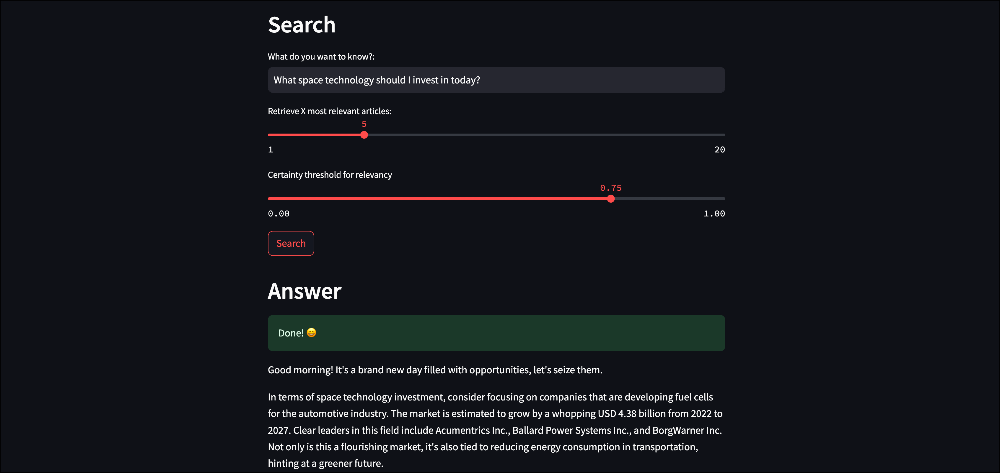

# LLMOps: Automated RAG Pipeline with Airflow, GPT-4 and Weaviate

A production-style LLMOps pipeline I built to learn how Retrieval-Augmented 
Generation works end to end — from automated data ingestion to vector search 
to GPT-4 powered financial Q&A, all orchestrated with Apache Airflow.



## What I Built

Instead of a simple LangChain script, I wanted to understand how RAG works in 
a real orchestrated pipeline. This project taught me how LLMOps differs from 
standard MLOps — the challenge isn't training, it's keeping the vector store 
fresh and the retrieval accurate.

The pipeline automatically:
- Fetches live financial news from Alpha Vantage daily
- Embeds articles using FinBERT (finance-domain embeddings)
- Stores vectors in Weaviate for semantic search
- Answers user questions via GPT-4 with retrieved context in a Streamlit UI

## Architecture

Alpha Vantage API
│
▼
Airflow DAG (finbuddy_load_news)
│  scheduled daily ingestion
▼
FinBERT Embeddings
│  768-dim financial domain vectors
▼
Weaviate Vector DB  ──▶  Semantic Search  ──▶  GPT-4  ──▶  Streamlit UI

## Key Learnings

- Airflow DAGs are far better than cron scripts for LLM pipelines — retries,
  logging, and dependency management are built in
- Embedding model choice matters: FinBERT outperforms ada-002 on financial 
  queries because it understands domain vocabulary
- Weaviate schema must be recreated when switching embedding models since 
  vector dimensions differ (768 vs 1536)
- RAG quality depends more on chunking and retrieval tuning than on the LLM

## Tech Stack

| Layer | Tool |
|---|---|
| Orchestration | Apache Airflow (Astro CLI) |
| Vector Database | Weaviate |
| Embeddings | FinBERT, OpenAI ada-002 |
| LLM | OpenAI GPT-4 |
| Frontend | Streamlit |
| Data Source | Alpha Vantage financial news API |
| Containerization | Docker |

## DAGs

| DAG | Purpose |
|---|---|
| `finbuddy_load_news` | Fetches and embeds latest financial news into Weaviate |
| `finbuddy_load_pre_embedded` | Loads pre-embedded articles for quick dev/testing |
| `create_schema` | Resets Weaviate schema (needed when switching embedding models) |

## Getting Started

**Prerequisites:** Docker Desktop, Alpha Vantage API key, OpenAI API key

```bash
# 1. Clone and configure
git clone https://github.com/midhunsomu/Airflow_LLM_RAG_Finance.git
cd Airflow_LLM_RAG_Finance
cp .env_example.txt .env
# Add your API keys to .env

# 2. Install Astro CLI (manages Airflow locally)
# https://docs.astronomer.io/astro/cli/install-cli

# 3. Start all services
astro dev start
```

Access the running services:
- Airflow UI: http://localhost:8080
- Weaviate endpoint: http://localhost:8081
- Streamlit Q&A app: http://localhost:8501

```bash
# 4. Load data — run either DAG from Airflow UI:
# finbuddy_load_news        → live articles (needs Alpha Vantage key)
# finbuddy_load_pre_embedded → prebuilt vectors for quick start

# 5. Ask financial questions in the Streamlit app at localhost:8501
```

## What I Would Add Next

- Automated re-embedding when source articles are updated
- Retrieval evaluation using RAGAS metrics (faithfulness, answer relevance)
- Hybrid search — combine dense vector search with BM25 keyword search
- LangSmith tracing for prompt and retrieval debugging
- Cost tracking per query (token usage logging)
